# DrillDowner Class Diagram

> Version 1.2.2 — generated from `src/DrillDowner.js`

```mermaid
classDiagram

    class DrillDowner {
        %% ── Static ──────────────────────────────────────────
        +String version$
        +String[] _SHORT_MONTHS$
        +String formatNumber(n, decimals)$
        +String formatDate(value, includeTime)$

        %% ── Public Instance Properties ───────────────────────
        +Element container
        +Array dataArr
        +Object options
        +Object grandTotals
        +Element table
        +Element|null controls
        +Element|null azBar

        %% ── Constructor ──────────────────────────────────────
        +constructor(container, dataArr, options)

        %% ── Public Methods ───────────────────────────────────
        +DrillDowner showToLevel(level)
        +DrillDowner collapseAll()
        +DrillDowner expandAll()
        +DrillDowner changeGroupOrder(newOrder)
        +void render()
        +Element getTable()
        +void destroy()

        %% ── Private State ────────────────────────────────────
        -Number _idCounter
        -Number activeLedgerIndex
        -Array _defaultColumns
        -Function _natSort
        -Function _boundOnTableClick
        -Function _onDrillClick
        -Function _onAZClick

        %% ── Private Render Methods ───────────────────────────
        -void _renderControls()
        -void _renderGroupingSelect(div)
        -void _renderBreadcrumbs(nav)
        -void _updateBreadcrumbVisuals(level)
        -void _renderTable()
        -void _buildFlatRows(data, groupOrder, level, parents, rows, tbody)
        -Element _buildRow(params)
        -Object _getRowSpec(params)
        -void _appendDataCells(tr, item, gData, isLeaf, overrides, level, ledgerCols)
        -void _renderAZBar()
        -void _applyAzBarOrientation()

        %% ── Private Data / Calculation ────────────────────────
        -Object _calculateGrandTotals()
        -String _formatGrandTotal(col)
        -Array _sortData(arr, keys)
        -Number _calculateRowImpact(row, colKey)
        -Array _generatePermutations(n, limit)
        -String _sanitizeIdPart(value)

        %% ── Private Column Accessors ──────────────────────────
        -any _getColProperty(col, prop, defaultValue)
        -Number _getColDecimals(col)
        -String _getColHeader(col)
        -String _getGroupIcon(col)
        -String _getColClass(col)
        -String _getColLabelClass(col)
        -Boolean _getColTogglesUp(col)
        -Function|null _getColFormatter(col)

        %% ── Private Interaction ───────────────────────────────
        -void _onTableClick(e)
        -void _onDrillClick(e)
        -void _onAZClick()
        -Array _getHierarchyForRow(row)
        -Element|null _findRowByHierarchy(displayNames)

        %% ── Private Remote / Fetch ────────────────────────────
        -Object _getRequestPayload(action, target)
        -void _remoteRequest(action, target)
        -void _fill(json)
        -void _injectChildRows(parentRow, rows, parentLevel)
    }

    class Options {
        <<interface>>
        +Array groupOrder
        +Array totals
        +Array columns
        +Object colProperties
        +Array|null groupOrderCombinations
        +Array ledger
        +string|null controlsSelector
        +string|null azBarSelector
        +string azBarOrientation
        +string|null remoteUrl
        +string idPrefix
        +boolean showGrandTotals
        +Function|null onLabelClick
        +Function|null leafRenderer
        +Function|null onGroupOrderChange
    }

    class ColProperties {
        <<interface>>
        +string label
        +string icon
        +number decimals
        +string class
        +string labelClass
        +Function|null formatter
        +Function|null renderer
        +boolean togglesUp
        +string|null subTotalBy
        +Object|null balanceBehavior
    }

    class BalanceBehavior {
        <<interface>>
        +number|null initialBalance
        +Array add
        +Array subtract
    }

    class LedgerEntry {
        <<interface>>
        +string label
        +Array cols
        +Array sort
    }

    class OnLabelClickContext {
        <<interface>>
        +string label
        +number level
        +string column
        +boolean isLeaf
        +Array hierarchyValues
        +Object hierarchyMap
        +Array groupOrder
        +Element rowElement
        +Object options
    }

    class RemoteRequest {
        <<interface>>
        +string action
        +Object data
    }

    class RemoteRequestData {
        <<interface>>
        +number level
        +number expandingLevel
        +string groupingDimension
        +Array displayNames
        +string rowId
        +Array groupOrder
        +Array requestedTotals
        +Array requestedColumns
    }

    class RemoteResponse {
        <<interface>>
        +boolean success
        +string|null error_message
        +Object data
    }

    class RemoteResponseData {
        <<interface>>
        +string action
        +Array rows
        +number level
        +string rowId
        +Object grandTotals
    }

    DrillDowner --> Options : configured by
    Options --> ColProperties : colProperties map
    Options --> LedgerEntry : ledger entries
    ColProperties --> BalanceBehavior : balanceBehavior
    DrillDowner ..> OnLabelClickContext : emits via onLabelClick
    DrillDowner ..> RemoteRequest : POSTs when remoteUrl set
    RemoteRequest --> RemoteRequestData : data payload
    DrillDowner ..> RemoteResponse : receives from server
    RemoteResponse --> RemoteResponseData : data payload
```



---

## Options Reference Table

| Option | Type | Default | Purpose |
|--------|------|---------|---------|
| `groupOrder` | `string[]` | `[]` | Hierarchy columns, outermost first |
| `totals` | `string[]` | `[]` | Numeric columns to sum at every level |
| `columns` | `string[]` | `[]` | Non-numeric display columns |
| `colProperties` | `Object` | `{}` | Per-column formatting and behaviour |
| `groupOrderCombinations` | `Array[]|null` | `null` | Fixed dropdown combinations; auto-permuted when null (capped at 9) |
| `ledger` | `LedgerEntry[]` | `[]` | Flat-view definitions; single object is auto-wrapped |
| `controlsSelector` | `string|Element|null` | `null` | Container for breadcrumbs + grouping dropdown |
| `azBarSelector` | `string|Element|null` | `null` | Container for A–Z quick-jump bar |
| `azBarOrientation` | `"vertical"|"horizontal"|"h"|"row"` | `"vertical"` | Orientation of A–Z bar |
| `remoteUrl` | `string|null` | `null` | Enables server-side drill-down via POST |
| `idPrefix` | `string` | `"drillDowner<random>_"` | Prefix for all DOM IDs |
| `showGrandTotals` | `boolean` | `true` | Show/hide `<thead>` sub-values and `<tfoot>` row |
| `onLabelClick` | `Function|null` | `null` | Callback when a label cell is clicked |
| `leafRenderer` | `Function|null` | `null` | Override for leaf-row label cells; wins over `colProperties[dim].renderer` |
| `onGroupOrderChange` | `Function|null` | `null` | Defined in defaults but **never called** — do not use |

---

## ColProperties Reference Table

| Property | Type | Default | Applies to | Purpose |
|----------|------|---------|------------|---------|
| `label` | `string` | capitalised key | any | Column header text |
| `icon` | `string` | `""` | groupOrder columns | Shown in breadcrumb next to the level name |
| `decimals` | `number` | `2` | `totals` | Decimal places for number formatting |
| `class` | `string` | `""` | any | CSS class on every data `<td>` |
| `labelClass` | `string` | `""` | any | CSS class on the `<th>` header cell |
| `formatter` | `(value, item) => string` | `null` | any | Format computed/raw value; `renderer` wins if both set |
| `renderer` | `(item, level, dimension, groupOrder, options) => string` | `null` | any | Full cell override; bypasses `formatter` and `togglesUp` |
| `togglesUp` | `boolean` | `false` | `columns` only | Group rows show distinct child values joined by `", "` |
| `subTotalBy` | `string|null` | `null` | `totals` only | Group sums by another field instead of a plain sum |
| `balanceBehavior` | `BalanceBehavior|null` | `null` | `totals` only | Running-balance column computed from `add`/`subtract` fields |

---

## Callbacks Signature Summary

### `onLabelClick(ctx)`
Fired when the user clicks a label span (not the drill icon).

```
ctx = {
  label:           string   — visible text of the clicked row
  level:           number   — 0 = outermost group
  column:          string   — groupOrder key at this level
  isLeaf:          boolean  — true when level > groupOrder.length - 1
  hierarchyValues: string[] — ["West", "Alice"] root-to-node path
  hierarchyMap:    Object   — { region: "West", rep: "Alice" }
  groupOrder:      string[] — snapshot of current groupOrder
  rowElement:      Element  — the <tr> DOM node
  options:         Object   — the full options object
}
```

### `leafRenderer(item, level, dimension, groupOrder, options) → string`
Overrides the label cell HTML for leaf rows only. Takes priority over `colProperties[dimension].renderer` at the leaf level.

### `colProperties[col].formatter(value, item) → string`
- For `totals` columns in grouped mode: `value` is the **sum for the group**.
- For `columns` columns: `value` is the raw field value (or comma-joined distinct values when `togglesUp: true`).
- `item` is `gData[0]` (first data object in the group) or the individual item for leaf/ledger rows.

### `colProperties[col].renderer(item, level, dimension, groupOrder, options) → string`
Full override — called for every row type (group, leaf, ledger). `item` is `gData[0]` for group rows.

---

## Remote Protocol (action values)

| Action sent | When |
|-------------|------|
| `"change_grouping"` | Grouping dropdown changes or initial render with `remoteUrl` |
| `"expandToLevel"` | `showToLevel()`, `expandAll()`, `collapseAll()`, breadcrumb click |
| `"expand"` | User clicks the drill icon on a collapsed row |

| Action received | Effect |
|-----------------|--------|
| `"expand"` | Injects child rows under `rowId` |
| `"expandToLevel"` | Replaces `dataArr` and re-renders |
| `"change_grouping"` | Replaces `dataArr` and re-renders |
